# Build Your First Agent in Copilot Studio

**Level:** 100 — Beginner
**Duration:** 30 minutes
**Product:** Microsoft Copilot Studio (GitHub Copilot harness)

---

## What you will build

An agent called **&lt;YourName&gt; Copilot Studio Support** that answers questions from the official Microsoft Copilot Studio documentation, emails answers to you on request, and uses a skill to produce structured briefings.

| Component | What you add |
|---|---|
| Instructions | The agent's role, tone and rules |
| Knowledge | Public website — Microsoft Copilot Studio documentation |
| Tool | Office 365 Outlook — Send an email |
| Skill | Doc Digest — a reusable briefing procedure |

---

## Prerequisites

- Access to Microsoft Copilot Studio
- The **New experience** setting turned on
- An Outlook mailbox in the same tenant
- **Your own first name to use as a prefix for your agent** — everyone shares one environment

---

## Before you start — switch to the lab environment

You must be in the **GroupIT - CPS Hackathon - Dev** environment. Agents you build anywhere else will not be part of this lab.

**The quickest way** — open this link, which takes you straight there:

```text
https://copilotstudio.preview.microsoft.com/
```

**Or switch manually:**

1. Select the environment name at the bottom left of the side pane.
2. In **Switch environment**, search for `GroupIT - CPS Hackathon - Dev`.
3. Select it.

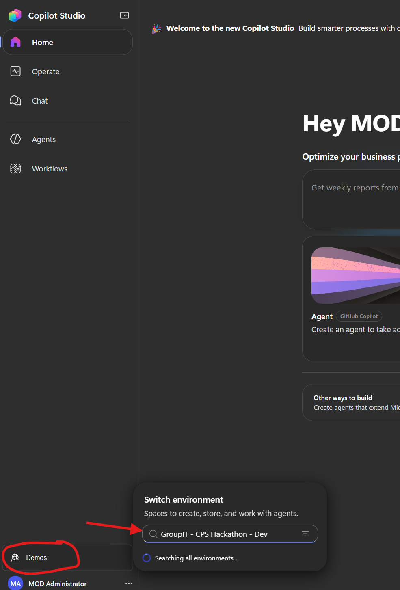

> **⚠️ Check this before every exercise**
>
> If you cannot find your agent later, the environment is the first thing to check.

---

## Exercise 1 — Create your agent

> **⚠️ Use your own name in the agent name**
>
> Everyone in this lab shares one environment and can see each other's agents. Replace `<YourName>` in the prompt below with your own first name, so your agent is easy to find and you do not edit someone else's by mistake.

1. Sign in to Copilot Studio.
2. Turn on **New experience** in the top right.
3. Copy the prompt below into the text box on the home page.
4. Replace `<YourName>` with your own first name.
5. Send the prompt.

```text
Create an agent called <YourName> Copilot Studio Support.

Its instructions: You are a support assistant that answers questions about
Microsoft Copilot Studio. Answer questions using only your knowledge source,
which covers the official Microsoft Copilot Studio documentation on Microsoft
Learn. If the documentation does not cover something, say so plainly instead
of guessing. Keep answers short: a direct answer first, then two or three
supporting bullets. Always name the documentation page the answer came from.
When the user asks you to send, email or share an answer, email it to them.
Be friendly and concise, and never invent product behaviour that is not in
the documentation.

Add a Public websites knowledge source scoped to this URL:
https://learn.microsoft.com/en-us/microsoft-copilot-studio/

Add the Office 365 Outlook tool "Send an email (V2)" so the agent can email
answers to me when I ask.

Add a skill called Doc Digest, described as: "Use when the user asks for a
summary, digest or briefing on a Microsoft Copilot Studio topic." Its
instructions: look the topic up in the knowledge source, then structure the
answer as four short sections - What it is, Why it matters, How to do it,
and a link to the documentation page. Then email the digest with the subject
line "Copilot Studio: <topic>".
```

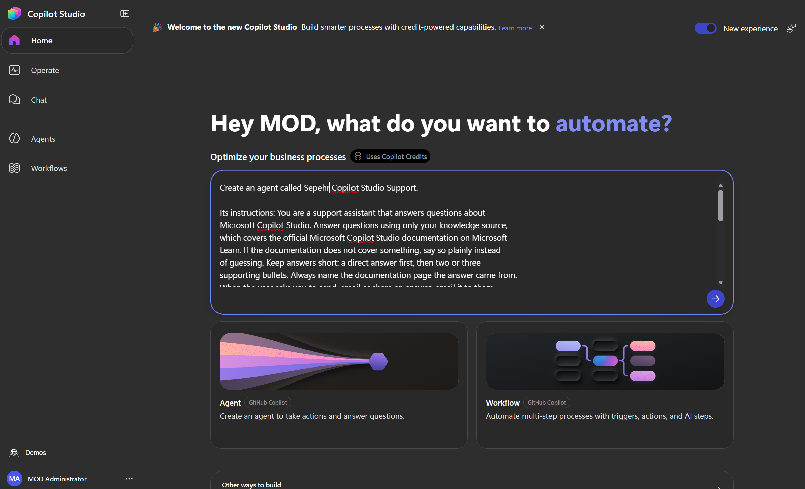

---

## Exercise 2 — Confirm to save

The builder takes a minute or two, then summarises what it made and waits for you.

1. Read the summary. Check it mentions the knowledge source, the email tool and the Doc Digest skill.
2. Check the agent card carries your own name.
3. Type **confirm** in the message box and send it.
4. Wait for the "Saved!" reply.

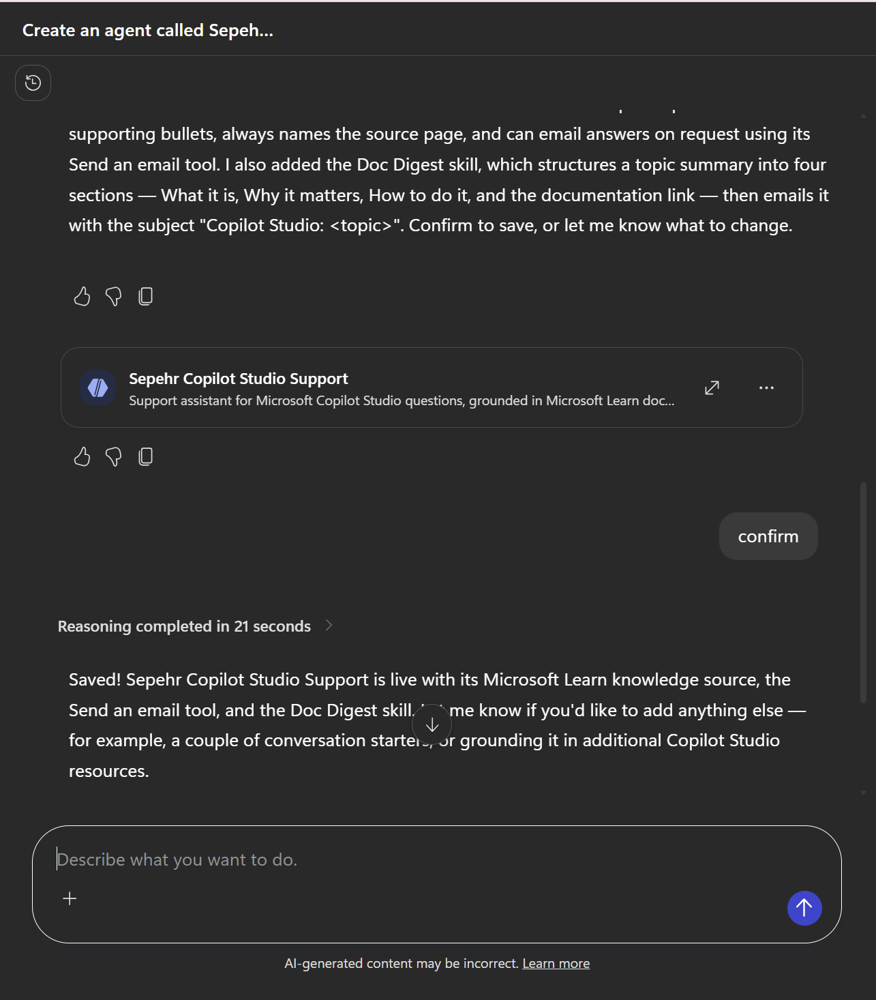

> **💡 Check the agent's name before you save**
>
> The name the agent has at its **first save** becomes its permanent internal name and cannot be changed afterwards. Make sure your own name is in it before you confirm.

---

## Exercise 3 — Open your agent

Your agent and its skill are listed in the **Artifacts** panel on the right.

1. Find your agent under **Artifacts**.
2. Select it to open the agent designer.

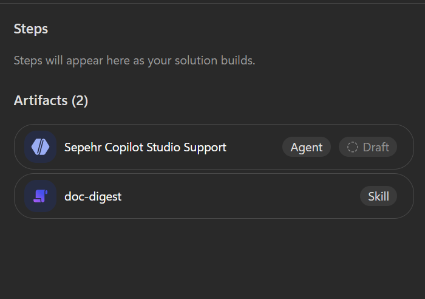

---

## Exercise 4 — Tour the Build tab

Everything that makes up your agent lives on the **Build** tab. The instructions are on the left, the components in the panel on the right.

1. Read the **Instructions** on the left.
2. In the panel on the right, find the three things the builder added:
   - **Skills** — doc-digest
   - **Tools** — Send an email
   - **Knowledge** — Copilot Studio documentation
3. Note the four tabs across the top: **Build**, **Preview**, **Evaluate**, **Monitor**.

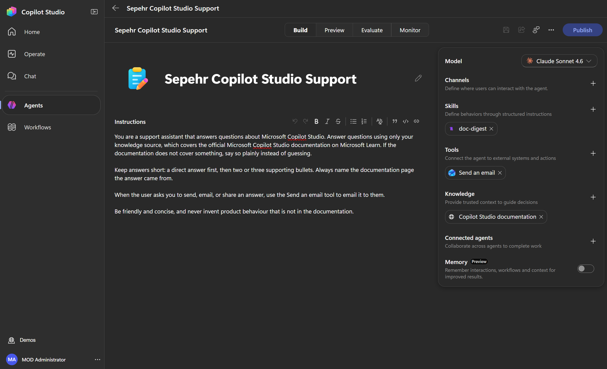

| Component | What it is |
|---|---|
| Model | The AI model that powers the agent's reasoning |
| Channels | Where users can interact with the agent |
| Skills | Reusable instructions that load when a request matches them |
| Tools | Connections to external systems and actions |
| Knowledge | Trusted content the agent answers from |
| Connected agents | Other agents this one can hand work to |
| Memory | Lets the agent remember context between conversations |

---

## Adding components by hand (not needed if your agent was built successfully with all its components)

Check the Build tab first: if **Skills**, **Tools** and **Knowledge** all show the components listed in Exercise 4, skip this section.

Otherwise — or if you want to know how it is done without the builder — add them yourself from the same panel. Each one starts with the **+** next to its heading.

### Add knowledge

1. On the **Build** tab, select **+** next to **Knowledge**.
2. Choose **Public websites**.
3. Paste the URL below.

```text
https://learn.microsoft.com/en-us/microsoft-copilot-studio/
```

4. Select **Add**.

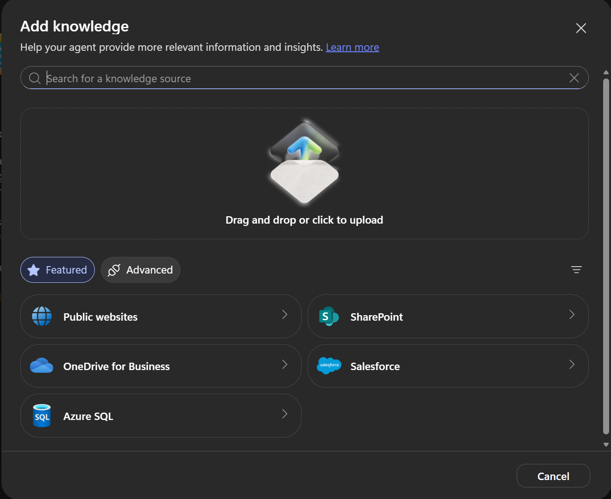

The dialog also offers file upload, SharePoint, OneDrive for Business, Salesforce and Azure SQL, with more under **Advanced**.

### Add a tool

1. Select **+** next to **Tools**.
2. Select **Office 365 Outlook**, or search for **Send an email**.
3. Choose the **Send an email (V2)** action and add it.
4. Approve the connection if you are asked to.

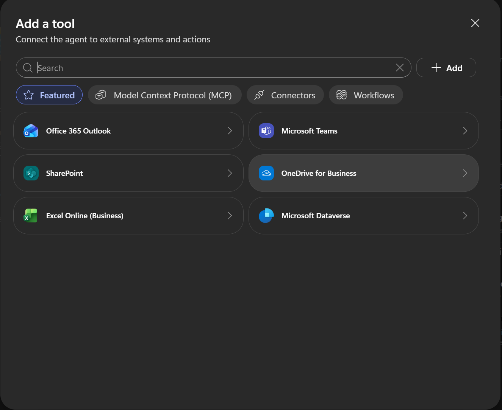

Tools also come from **Model Context Protocol (MCP)** servers, **Connectors** and **Workflows** — the tabs across the top of the dialog.

### Add a skill

1. Select **+** next to **Skills**.
2. Choose one of the three tabs:

| Tab | Use it to |
|---|---|
| Upload a skill | Add a skill someone already wrote, as a Markdown file or a ZIP package |
| Generate with AI (preview) | Describe the skill in plain words and let Copilot Studio write it |
| Create from blank | Write the name, description and instructions yourself |

3. On **Generate with AI**, describe what the skill should do, then select **Build**.
4. Review what it produced before adding it to your agent.

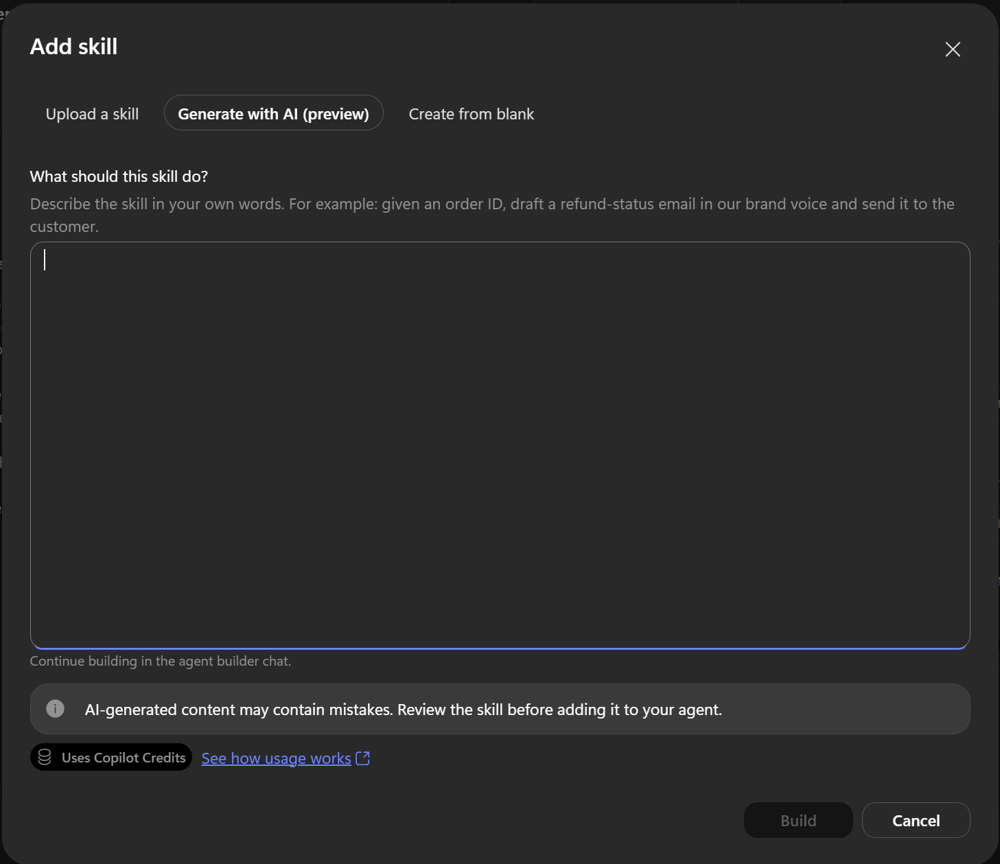

> **ℹ️ The skill description is the trigger**
>
> A skill has three parts: a name, a description, and instructions. The orchestrator reads the **description** to decide whether to activate the skill. The instructions only run once it does.
>
> Vague descriptions are the most common reason a skill never fires — or fires when it should not.

---

## Exercise 5 — Test your agent

1. Select the **Preview** tab.
2. Ask a question. For example:

```text
What is the difference between the github harness and standard harness
```

3. Expand **Reasoned through your request** to see the agent search its knowledge before answering.

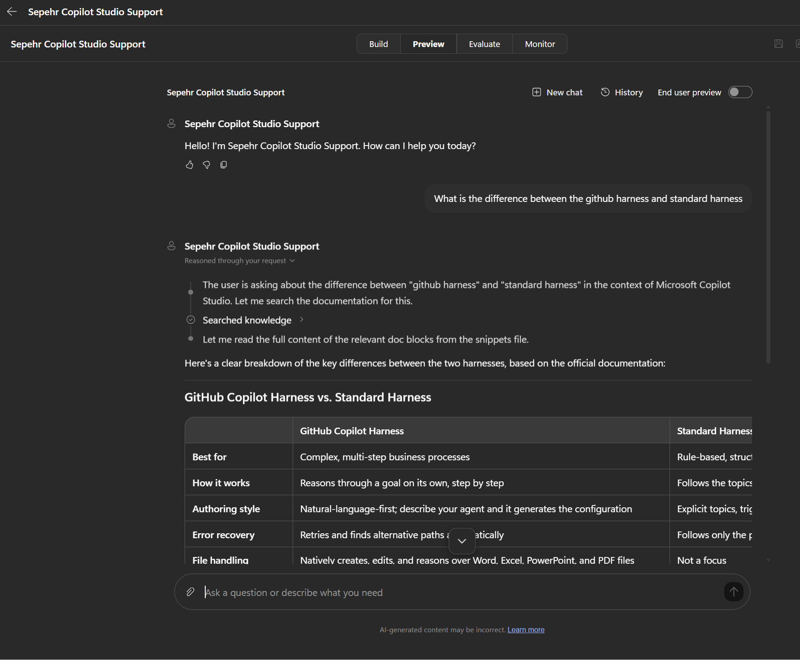

> **💡 Read the reasoning trace**
>
> The steps above the answer show what the agent actually did — searching knowledge, then reading the matching documentation. This is the fastest way to work out why an agent answered the way it did.

Other questions to try:

```text
What types of knowledge sources can I add to an agent?
```

```text
How do I publish an agent to Teams?
```

---

## Exercise 6 — Email an answer

1. In the same conversation, ask the agent to email the answer to you:

```text
Send this summary over email to myself
```

2. Select **Allow** when the permission prompt appears.
3. Check your inbox.

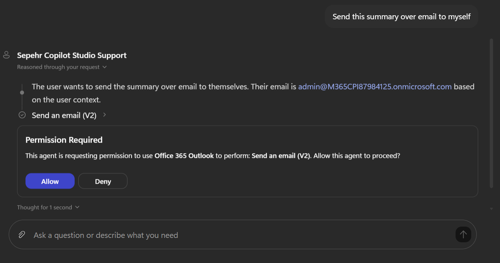

> **💡 The agent asks before it acts**
>
> Answering a question happens automatically, but using a tool that acts on your behalf needs your permission first. You approve the action, not the agent.

The email arrives with the answer formatted as a table.

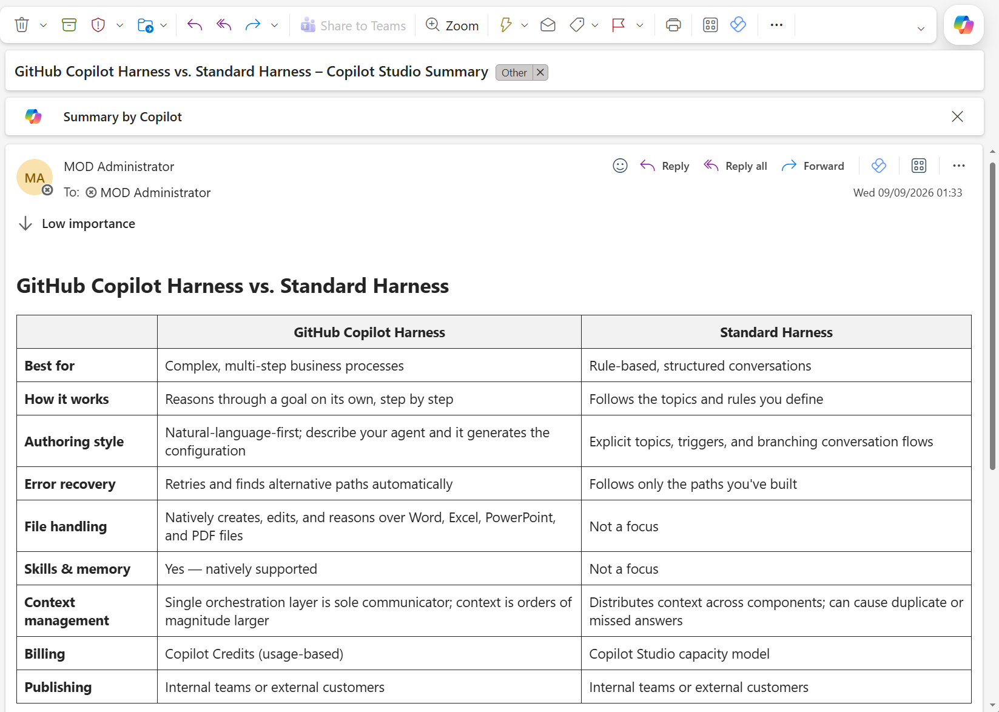

Your agent has now done all three things: answered from documentation, reasoned about what you asked, and taken an action in another system.

---

## What you learned

- An agent is built from **instructions**, **knowledge**, **tools** and **skills**, all on the Build tab
- You describe an agent in plain language and the builder assembles it — or you add each component yourself
- Knowledge grounds the agent in trusted content; tools let it act in other systems
- A skill's **description** is what decides when it loads
- The reasoning trace shows you why the agent did what it did

---

## Where to go next

**Go deeper on this harness**

- [GitHub Copilot Harness — Component Model](https://microsoft.github.io/mcs-labs/labs/mcs-github-harness/) — Level 300, 60 minutes. Builds an agent with multiple knowledge sources and tools, then has you read the reasoning loop and watch it recover from a failing tool call.
- [Recruit — GitHub Copilot Harness](https://microsoft.github.io/agent-academy/recruit-nextgen/) — a beginner course of eleven missions covering skills, tools, workflows and publishing to Teams. Earns a badge.
- [All Copilot Studio labs](https://microsoft.github.io/mcs-labs/)

**The documentation your agent is grounded in**

- [Microsoft Copilot Studio documentation](https://learn.microsoft.com/en-us/microsoft-copilot-studio/)
- [About agents powered by the GitHub Copilot harness](https://learn.microsoft.com/en-us/microsoft-copilot-studio/agents-experience/overview)
- [Configure agent details and instructions](https://learn.microsoft.com/en-us/microsoft-copilot-studio/agents-experience/authoring-instructions)
- [Add knowledge sources to an agent](https://learn.microsoft.com/en-us/microsoft-copilot-studio/agents-experience/knowledge-add-existing-copilot)
- [Skills overview](https://learn.microsoft.com/en-us/microsoft-copilot-studio/agents-experience/skills-overview)
