# Lab: Build an Autonomous Product Alerts Agent in Copilot Studio

In this lab you will build an agent in Microsoft Copilot Studio that monitors product inventory in Dataverse, generates daily product alerts, and emails them to you automatically. Along the way you will work with custom instructions, Power Fx expressions, Dataverse knowledge, the Dataverse MCP server, autonomous triggers, and Deep Reasoning.

---

## Step 1 — Open Copilot Studio and select your environment

1. In your browser, navigate to **https://copilotstudio.microsoft.com/**.
2. In the top-right corner of the page, confirm that the active environment is **EA FVC Environment DEV**. If a different environment is shown, click the environment selector and switch to **EA FVC Environment DEV** before continuing.

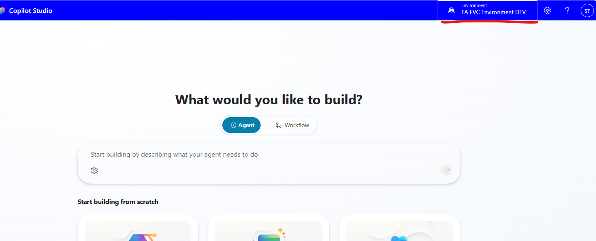

---

## Step 2 — Create a blank agent

1. Go to the **Agents** tab.
2. Click **+ Create blank agent**.

   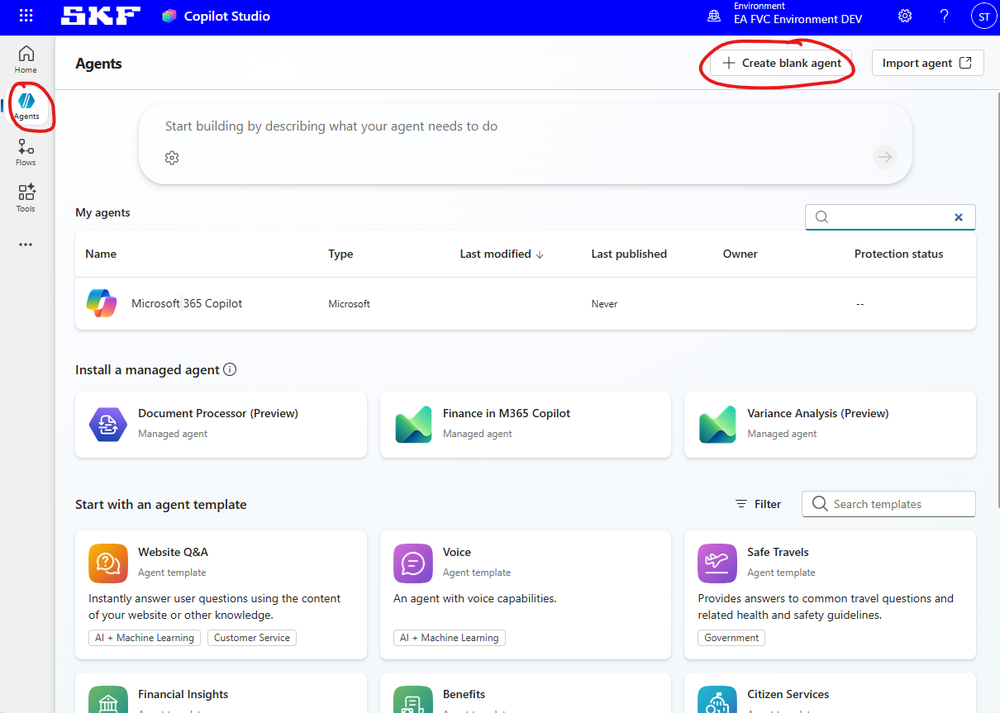

3. In the popup:
   - **Name:** `<Your Name> Stock Alert Agent`
   - **Description:** `Autonomous agent that tracks inventory levels and sends alerts.`
4. Click **Create**.

---

## Step 3 — Add the agent instructions

1. Next to the **Instructions** pane, click **Edit**.
2. Replace the contents with:

   ```
   Todays date is: 

   Now()


   When asked for product alerts, look for:

   - Products with low stock (<10 units), from the Demo Inventory Stock Record table
   - For each of the products with low stock, find their total sales over the last 30 days.

   **ALWAYS** present the products in a table format with the following columns:
   - Product name (refered to as ProductDesignation in the database)
   - Current stock specified as column StockOnHandQty
   - Total sales over last 30 days
   - Estimated days of stock remaining
   - Suggest whether restock is needed (lest than 20 days left)

   Only report products where action is needed.

   IMPORTANT: When using the Dataverse MCP Server tool, ONLY use SQL keywords, SELECT, FROM, WHERE, SUM, GROUP BY, IN.  NEVER use CASE WHEN, HAVING,DATEADD, GETDATE, GETDATEUTC. Always Alias aggregate values
   ```

   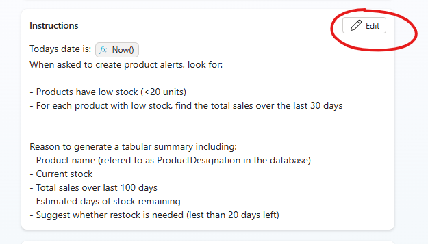

---

## Step 4 — Replace Now() with a Power Fx expression

1. In the Instructions pane, locate **Today's date is: Now()**.
2. Delete the **Now()** text.
3. In its place, type **`/`** and select **Power Fx**.
4. In the formula window, type **`Now()`** and click **Insert**.
5. Click **Save**.

   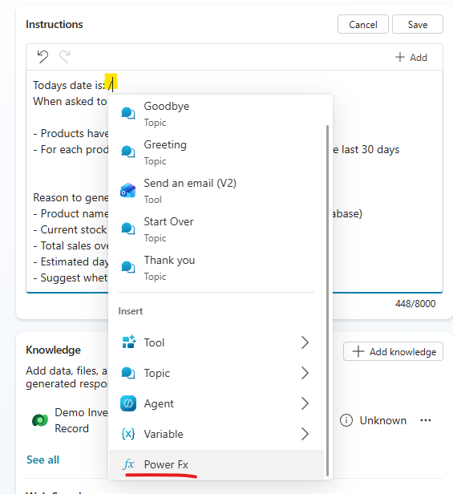

---

## Step 5 — Restrict the agent's knowledge sources

1. Open the agent **Settings**.

   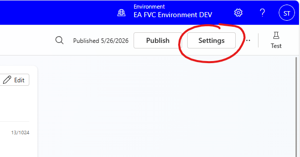

2. Scroll to the **Knowledge** section.
3. Turn **off**:
   - **Allow ungrounded responses**
   - **Use information from the Web**

   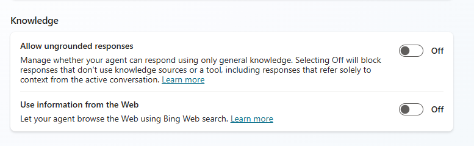

4. Click **Save**.

---

## Step 6 — Add Dataverse knowledge

1. In the **Knowledge** section, click **+ Add knowledge**.

   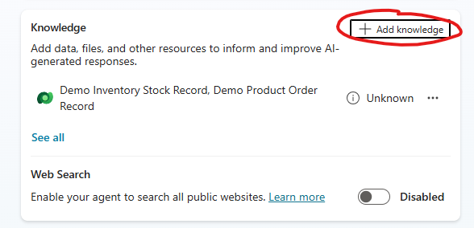

2. In the **Add knowledge** dialog, select **Dataverse**.

   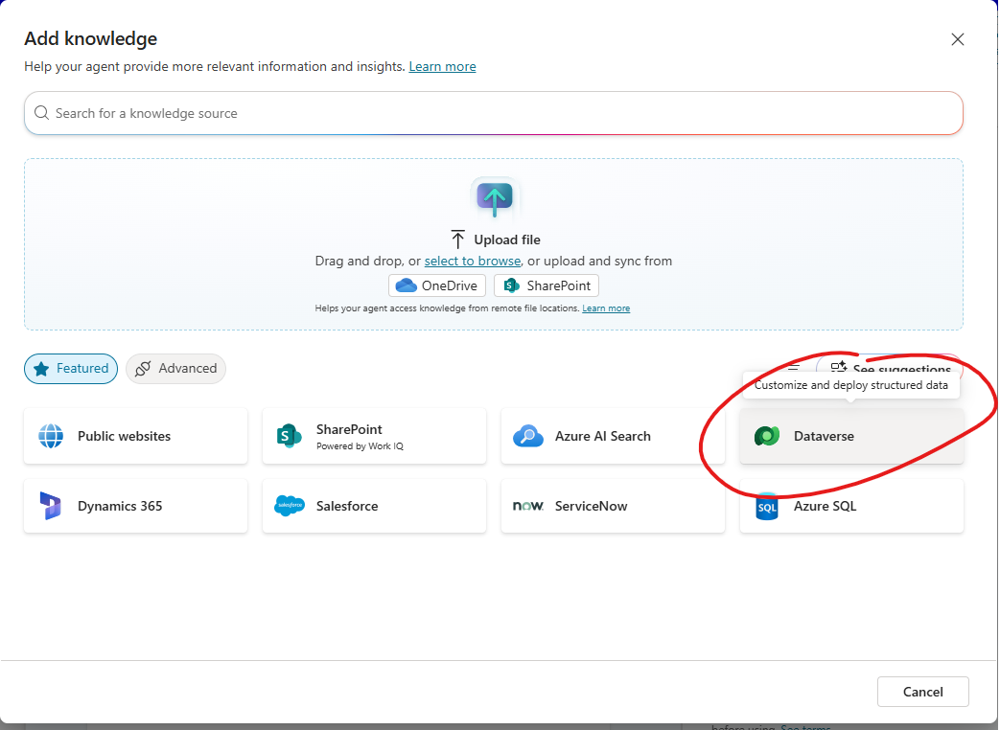

3. Search for `crfaa_Demo` and select:
   - **Demo Inventory Stock Record** (`crfaa_DemoInventoryStockRecord`)
   - **Demo Product Order Record** (`crfaa_DemoProductOrderRecord`)
4. Click **Add to agent**.

   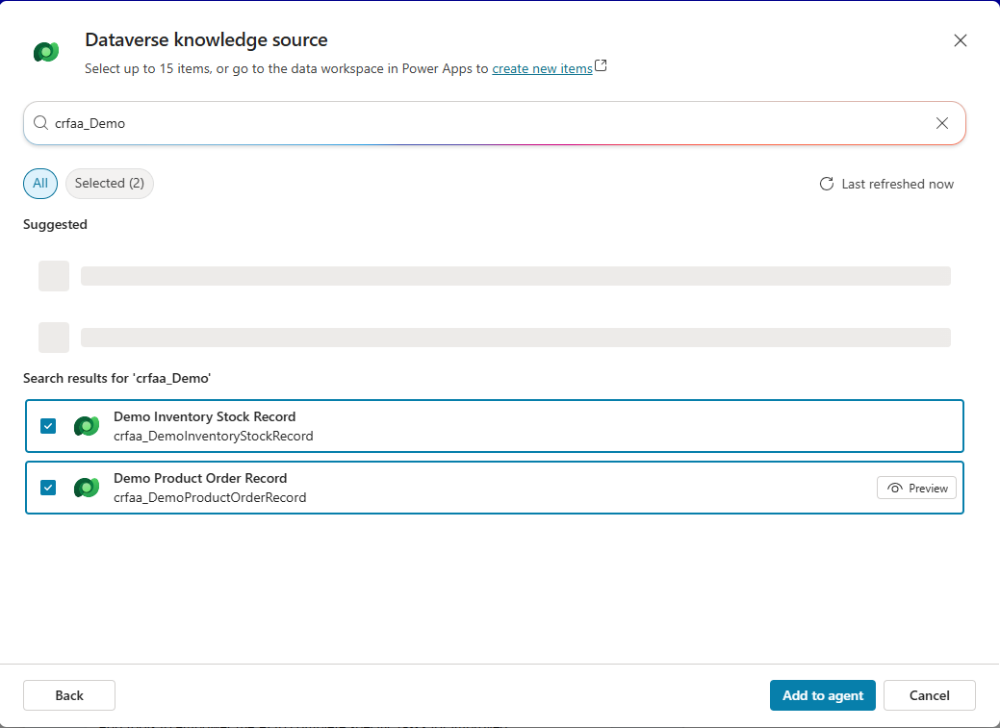

---

## Step 7 — Test the agent with knowledge

1. In the test pane, enter:

   ```
   What product alerts are there?
   ```

2. Review the response and the activity feed.

   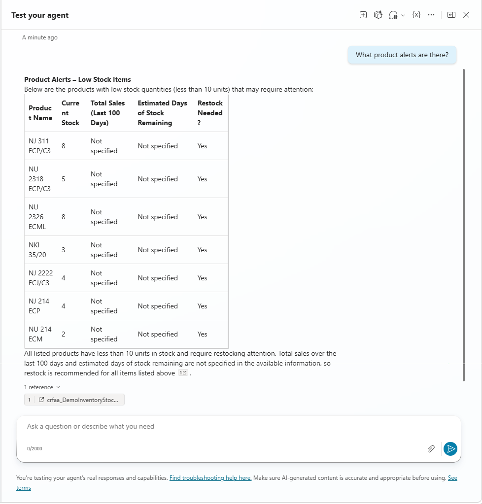

> When you connect Dataverse as a knowledge source, Copilot Studio indexes the data and the agent retrieves it using semantic search — a proven approach that delivers accurate answers across a wide range of scenarios. Because the agent works with a limited set of rows at a time, calculated fields such as total sales over the last 100 days or estimated days of stock remaining may sometimes come back as *Not specified*.
>
> Refining the **instructions** can resolve this by telling the agent how your data is structured and how to interpret it. For more demanding scenarios — such as aggregating across tables — Copilot Studio also supports using an **MCP (Model Context Protocol) server**, which we will use in the next steps.

---

## Step 8 — Remove the knowledge and add the Dataverse MCP

1. In the **Knowledge** tab, delete the two `crfaa_Demo*` tables you added.

   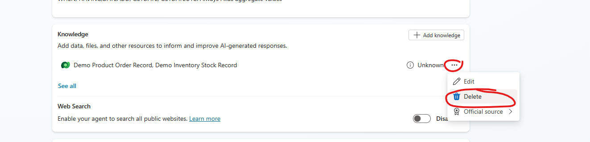

2. Go to **Tools** > **Add tool**.

   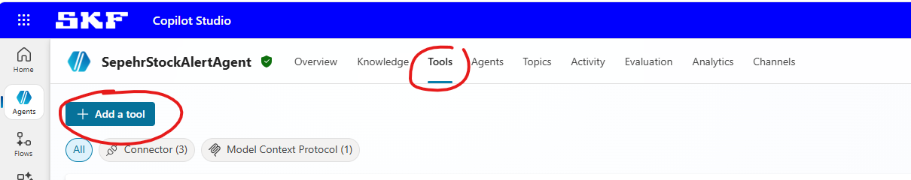

3. Open the **MCP** tab.

   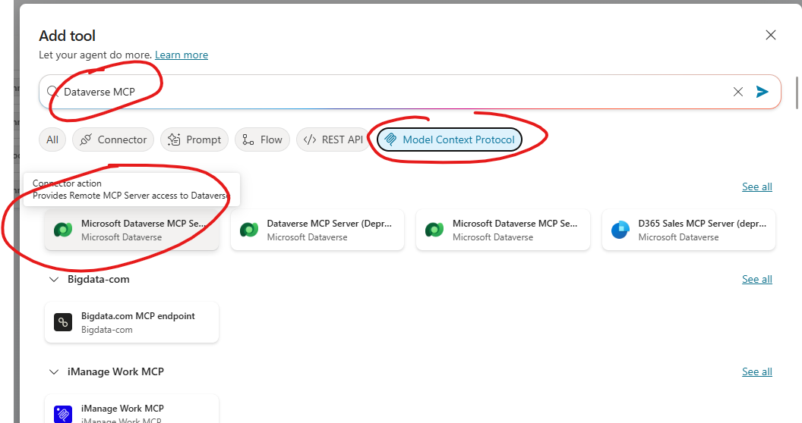

4. Select **Dataverse MCP**.
5. Click the **Connection** field and select **Create new connection**.

   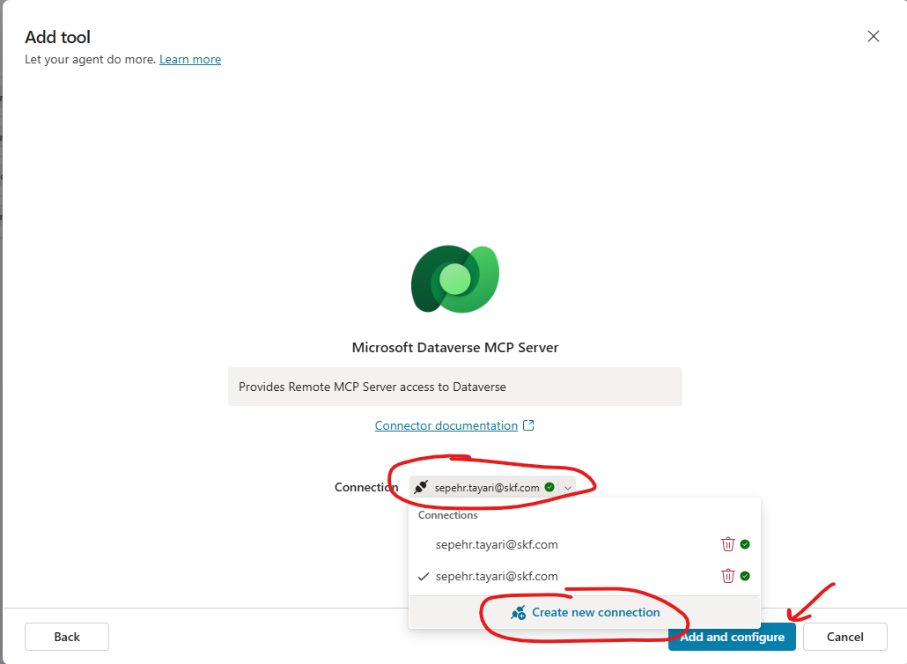

6. Click **Add and configure**.

---

## Step 9 — Lock down the MCP to read-only

> **Important:** The Dataverse MCP can perform full **CRUD** operations (Create, Read, Update, Delete) on tables and records. For this lab the agent only needs to **read** data, so we must disable everything else to prevent it from modifying or deleting your Dataverse data.

1. In the Dataverse MCP configuration, **enable**:
   - `list_tables`
   - `describe_table`
   - `read_query`
   - `fetch`
   - `list_apps`

2. **Disable**:
   - `create_table`
   - `update_table`
   - `delete_table`
   - `create_record`
   - `update_record`
   - `delete_record`

 <!--  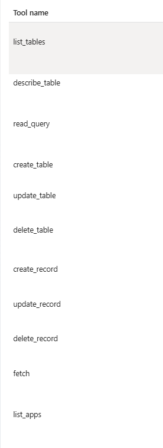 -->

3. Click **Save**.

---

## Step 10 — Test the agent with the MCP

1. In the test pane, enter:

   ```
   What product alerts are there?
   ```

2. Review the response.

   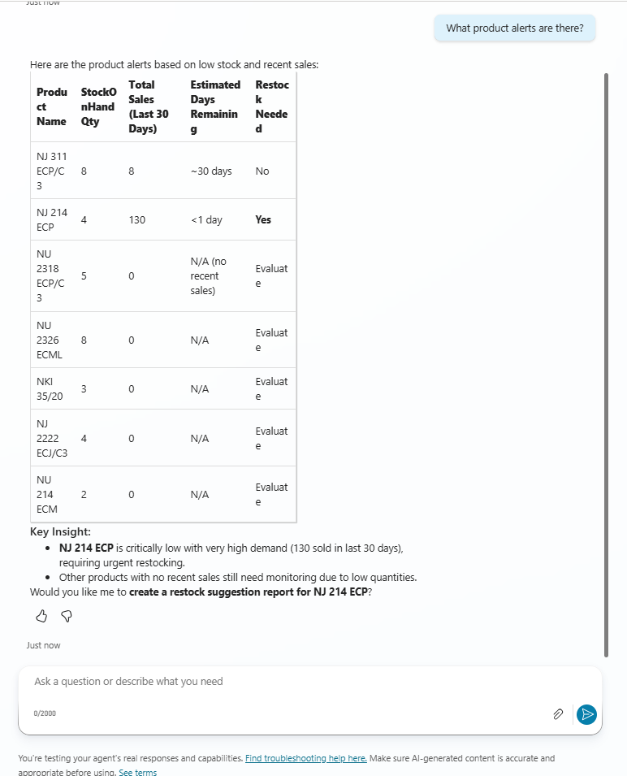

> Your output may differ from the screenshot — the agent generates its own SQL on the fly, so the columns, row count, and formatting can vary between runs.

3. Open the **activity map** to see exactly what the MCP did — including the SQL queries the agent generated and the data returned.

   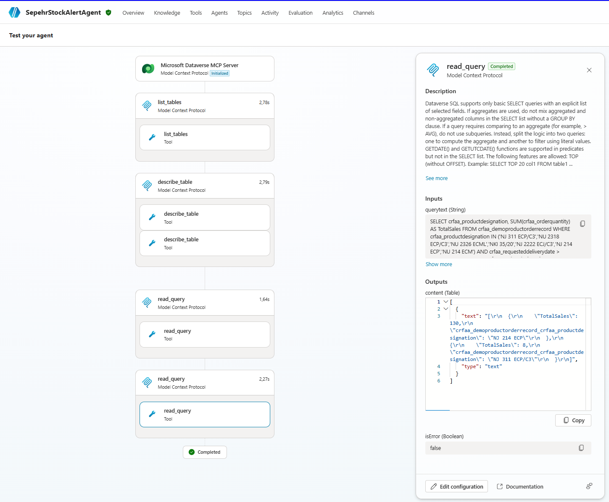

> [!INFO]
> **Can't see the activity map?** Enable it from the toggle shown below.
>
> 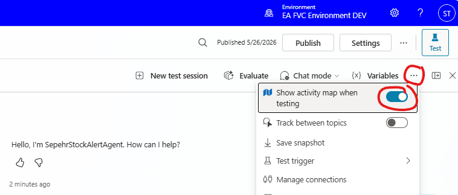

---

# Add Autonomous Capability

## Step 11 — Add the Send email tool

Now that the agent can pull the data it needs from Dataverse, we'll set up how it will notify us — by email. This is one of the building blocks of an **autonomous agent**: giving it a way to take action on its own.

1. Go to **Tools** > **Add tool**.

   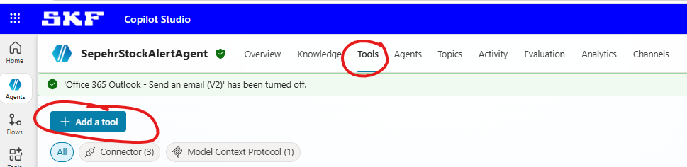

2. Search for **Send an email**.
3. Select **Send an email (V2)**.

   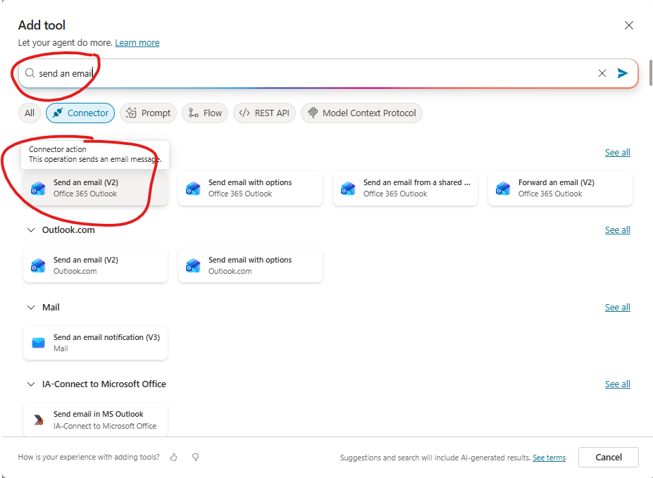

4. Click **Add and configure**.

---

## Step 12 — Configure the email tool

1. Replace the **tool description** with:

   ```
   This tool sends a product alert email when needed
   ```

2. Configure the **To** input:
   - Select **Custom value**.
   - Enter **your own email address** (the one you want the alerts sent to).

   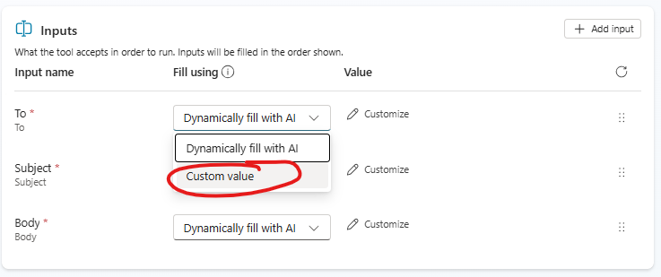

3. Configure the **Body** input:
   - Click **Customize**.
   - Replace the **Description** with:

     ```
     An Html formatted list of product alerts with a summary, with pretty colorful formatting
     ```

   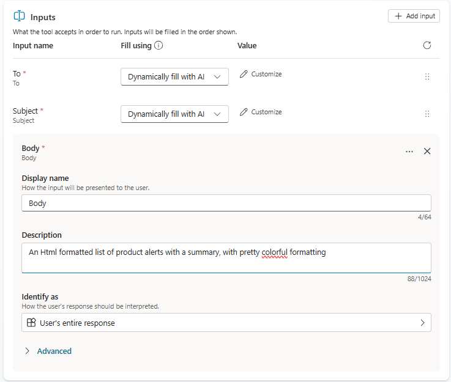

4. Click **Save**.

5. Verify the connector works — in the test pane, enter:

   ```
   Check the product alerts and send me a product alert email.
   ```

   Confirm that you receive the email.

   

---

## Step 13 — Add a recurrence trigger

1. Scroll to the **Triggers** section.
2. Click **Add trigger**.

   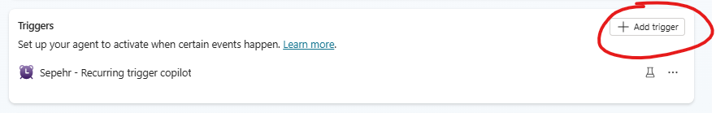

3. Select **Recurrence**.

   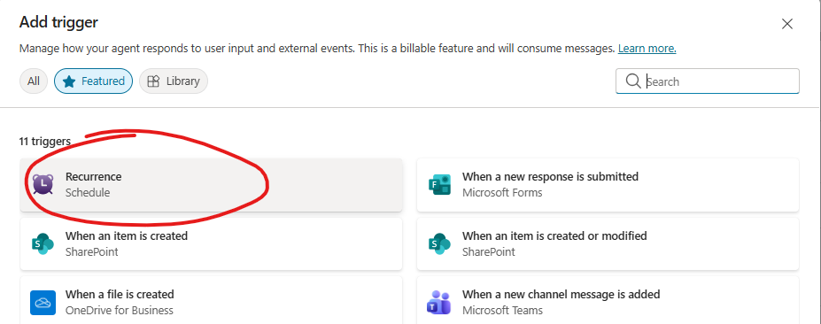

4. Rename the trigger to start with **your own name** (for example, `Sepehr — Daily product alerts`) so it doesn't get mixed up with other participants' triggers.

   

5. Set:
   - **Interval:** `1`
   - **Frequency:** `Month`
6. Replace the **trigger instructions** with:

   ```
   Execute the following steps:
   1. Check for product alerts.
   2. If there are product alerts, send a product alert email.
   ```

7. Click **Create**.

> [!IMPORTANT]
> **Don't forget to turn off the trigger after testing!** If you leave it on, the agent will keep sending you automated product alert emails on every scheduled run.

---

## Step 14 — Test the trigger

1. In the **Triggers** section, click **Test** on your recurrence trigger.
2. In the popup, click **Start testing**.

   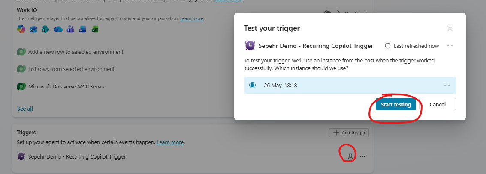

3. Check the **test window** to see what the trigger executed and the message it sent.

   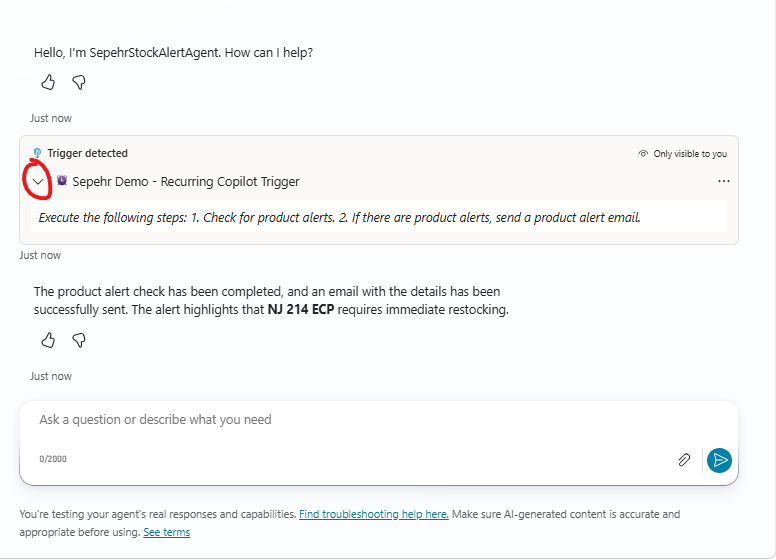

4. Open your email and confirm the product alert message was received.

---

# Showcase Deep Reasoning

## Step 15 — Enable Deep Reasoning

1. Go to the agent **Settings**.
2. Toggle **Deep Reasoning** on.
3. Click **Save**.

---

## Step 16 — Publish the agent to Teams (optional)

> This step is **optional** — it's a demo, and publishing may be limited in your environment.

1. Publish the agent.
2. Add the agent to **Microsoft Teams**.
3. Open the agent in Teams and test it.

---
